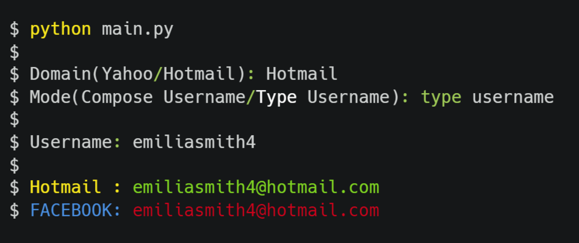

# Email Cloner

Selenium based solution to check whether hotmail/yahoo mail address is clonable or not, then check if it's linked to a facebook account either by directly typing the email or composing a set of most of the possible emails and respectively checking if anyone of them is clonable

&nbsp; &nbsp; &nbsp; &nbsp; &nbsp; &nbsp; &nbsp; &nbsp; &nbsp; &nbsp; &nbsp; &nbsp; 

## What is Email cloning?

- Hotmail/Yahoo accounts are deleted after 1 year if it's not used. Hence the mail address of that  account will be available for anyone who wants to take this address for his own account and the originial address owner will permanently lose the address
-  In case this deleted email address is linked to a facebook account, The original owner will not be able to recover his Facebook account that's linked to the deleted yahoo mail address if he forgot the password
-  If that same mail address is assigned to a new email account then this new account owner will be able to gain full access to the facebook account that is owned by the old yahoo mail owner and change the facebook account's password and then ultimately will have the ability to kick the old owner out of his facebook account

&nbsp; &nbsp; &nbsp; &nbsp; &nbsp; &nbsp; &nbsp; &nbsp; &nbsp;  

## Usage

&nbsp;

1. Compose Username

&nbsp;
</img>

&nbsp; &nbsp; &nbsp; &nbsp; &nbsp; &nbsp; &nbsp; &nbsp; &nbsp;

2. Type Username

&nbsp;
</img>

&nbsp;

## Examples

 #### The following examples are fully automated by python script using selenium

1. Yahoo
&nbsp;

https://user-images.githubusercontent.com/85782358/192112721-e9907769-4458-4ce9-ace9-5a667ff26727.mp4

&nbsp;

2. Hotmail
&nbsp;

https://user-images.githubusercontent.com/85782358/192112887-effe9d14-06b7-4f04-8685-c085c72ed4c6.mp4

&nbsp;

## Special Notes

- if YAHOO: "address" or HOTMAIL: "address" is green, then email is clonable
- if FACEBOOK: "address" is green, then facebook account linked to the email is hackable 

